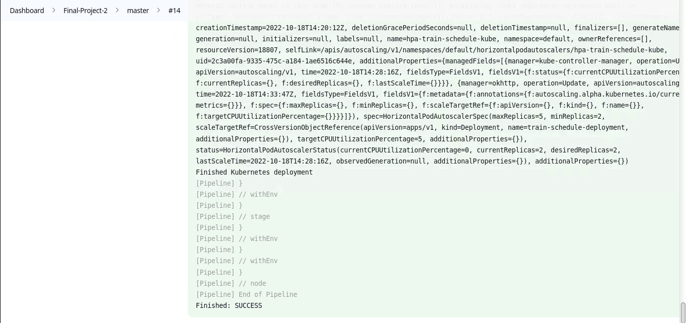

1. Link github repo: https://github.com/lam-phanminh/End-Project-2

2. To run Jenkinsfile. I set up a node docker. 
   
    
    
    

3. Set up credentials: 

   

4. Create job multi branch: 
   
    
    
    
    

5. Console output: 
   - Stage: ``Build ``
  
    

   - Stage: `` Build Docker Image `` 
  
    

   - Stage: `` Push Docker Image`` 

    
    

   - Stage: `` CanaryDeploy`` 

    
    

   - Stage: `` DeployToProduction``

    
       

6. Images pushed to dockerhub: 
   
    

7. Deployments: 

     

8. Services: 

    

9. Pods: 
    
     

10. Install metric-server: ``kubectl apply -f https://github.com/kubernetes-sigs/metrics-server/releases/latest/download/components.yaml``

    
    

11. ``kubectl top pod`` 

    

12. Config HPA to deployments: 

     
     

13. ``kubectl describe hpa hpa-train-schedule-deployment-canary ``

    
    
14. ``kubectl describe hpa kubectl describe hpa hpa-train-schedule-kube``

    

15. `` kubectl get hpa ``

    

16. Deploy ``Prometheus - Grafana`` by ``helm`` 
- Run commands: 
    + ``kubectl create namespace monitoring`` 
    + ``helm repo add prometheus-community https://prometheus-community.github.io/helm-charts``
    + ``helm repo update`` 
    + ``helm install prometheus-grafana-stack prometheus-community/kube-prometheus-stack --namespace monitoring``

    

- NodePort Prometheus and Grafana. 
  
- Access Prometheus: 
  
   

- Access Grafana, login and import dashboard ID ``1860``

   